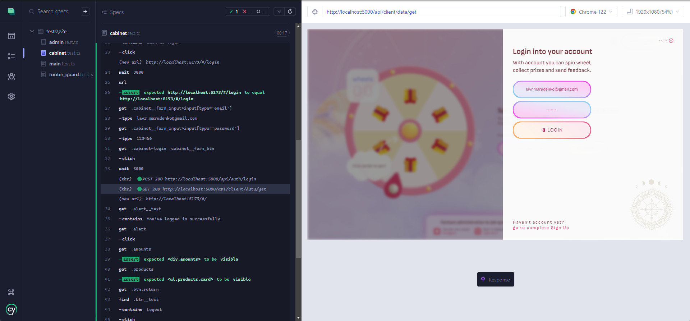
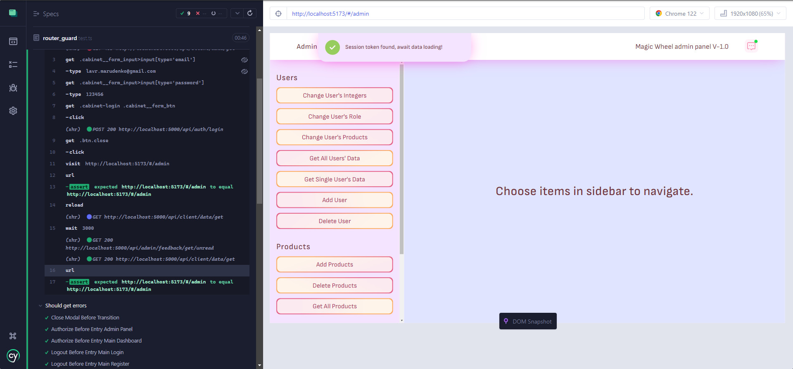
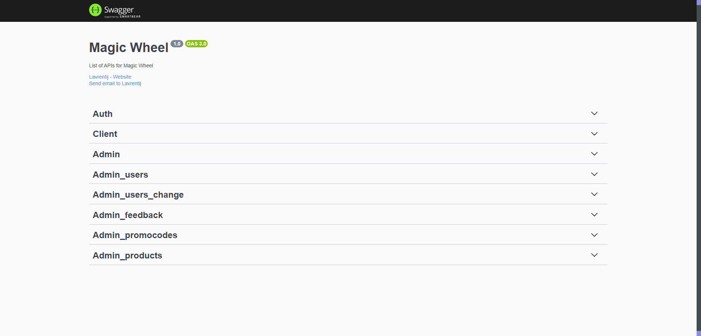
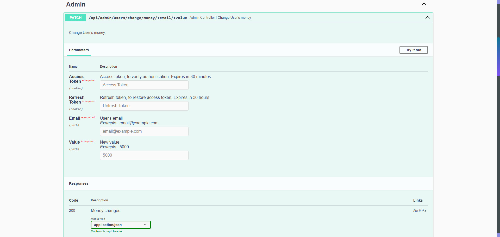

# FullStack pet-project made more than a year ago.
## Navigation
- [**About**](#about)
- - [Technology stack](#technology-stack)
- - - [Why Vue.js](#why-vuejs)
- - - [Why postgreSQL](#why-postgreSQL)
- - - [Why Nest.js](#why-nestjs)
- - [Backend functionality](#backend-functionality)
- - [Frontend pages](#frontend-pages)
- - [Entities](#entities)


- [**Prepare to launch**](#prepare-to-launch)
- - [Setup](#setup)
- - [Running](#running)


- [**Code details**](#code-details)
- - [Frontend](#frontend)
- - - [Components](#components)
- - - [State](#state)
- - - [Routing](#routing)
- - - [Assets](#assets)
- - - [Helpers](#f-helpers)
- - - [Testing](#f-testing)
- - - [NPM scripts](#f-npm-scripts)
- - [Backend](#backend)
- - - [Connect database](#connect-database)
- - - [Controllers](#controllers)
- - - [Services](#services)
- - - [Middlewares](#middlewares)
- - - [Swagger](#swagger)
- - - [Helpers](#b-helpers)
- - - [Testing](#f-testing)
- - - [NPM scripts](#b-npm-scripts)


- [**Contacts**](#contacts)
---
## About
### Technology stack
- **Frontend**: Vue.js 3 Composition API, TypeScript, Vue Router, Pinia, Axios, Vite, Vitest, Cypress, Sharp
- **Backend**: Nest.js, Express, TypeScript, JWT, Mocha + Chai, PostgreSQL
- **Deploy**: Docker-compose
- **Linting**: Eslint, Prettier, Vue Volar
#### Why Vue.js
- Comprehensive ecosystem (Vite, Vitest, Volar, Pinia, Vue Router)
- Amazing development experience (it's my favorite framework)
- Excellent performance
- High Versatility and flexibility
- Strong documentation and learning resources
- SFC format

#### Why postgreSQL
PostgresQL in case that:
- It has flexible access to data, its organization and storage.
- Support V8 JS engine, correspond ACID.
- Good npm packages: pg, pg-hstore.
- Functional UI PgAdmin.
- OpenSource and cross-platform.

#### Why Nest.js
NestJS is my chose for Javascript backend, due to the following advantages:
- Built-in deep Typescript integration.
- Built-in Express integration.
- Powerful CLI.
- Well-organized structure (controllers, services, guards and repositories in specific locations and in a specific manner).
- OpenSource.
### Backend functionality
**Authorization** provided by JWT tokens, that stores within secure cookies.

Frontend communicates with server via **Rest API**, its services divided for three groups:
- **General (auth)**: Available to everyone, authorization isn't required (*login* and *registration* services). 
- **For authorized (client)**: Available only to authorized users (*spin roulette*, *verify promocode*, *sending feedback* and *get account state* services).
- **For admins (admin)**: Available only to admin *role* accounts (operate with users' data, change promocodes/products and feedback services).
### Frontend pages
- **Main**: Made for spinning roulette, verify promocodes,
sending feedback to administrations and entry cabinet, where able to register/login or view profile info,
balance and products.
- **Admin panel**: For receiving messages from users and operate with services (change users' data, promocodes and products).
### Entities
**User:**
- *user_name*: Just username, used for notifications.
- *user_email*: The only unique field, used for operations with an account.
- *user_password*: Password chosen during registration, stores in DB encrypted.
- *user_wheels*: Attempts to spin roulette.
- *user_money*: Just an amount of empties.
- *user_role*: Account role, used for controlling access to services.
- *user_books*: List of owned books.
- *user_movies*: list of owned movies.

**Promocode:**
- *promo*: Promocode itself.
- *promo_type*: Type of prize received after using the promotional code.
- *promo_value*: Value of prize described above.

**Products:**
- *products_books*: List of available books to win.
- *products_movies*: List of available movies to win.

**Feedback_message:**
- *msg*: Message text.
- *msg_id*: Message unique ID, automatically increments.
- *status*: Message status unread / read.
- *sender_name*: The name provided by the sender.
- *sender_email*: The automatically picked from sender account.
---
## Prepare to launch
### Setup
- **Docker**: Create `.env` file, inside root directory and configure environment variables for **[docker-compose.yml](docker-compose.yml)**.
- **Local running**: Install dependencies within backend and frontend folders, then create `.env` files and define variables.

Create a database locally / inside **docker**:
```postgres-psql
CREATE DATABASE ROULETTE_APP OWNER = owner_name;
```
Then create four tables within a database by commands from **[db_setup.sql](backend/src/database/db_setup.sql)**
Make sure that you have run an empty postgreSQl database, and it's working correctly.

After [Running](#running) create an account within app, and give ADMIN access yourself:
```postgres-sql
UPDATE Users SET user_role = "ADMIN" WHERE user_email = "email";
```
### Running
- **Docker**: Open terminal in project root, then just run `make build` to build frontend and backend images,
  then run `make up` for getting up docker-compose.<br>
  To shut down docker run `make down`.
- **Local running**: Run `npm run dev` within backend and frontend folders.
--- 
## Code details
### Frontend
#### Components
- **[Pages](frontend/src/components/pages)**: Page carcases components, includes initial logic within.
- **[Sections](frontend/src/components/sections)**: As a rule, reusable or extracted for minimizing components.
- **[Views](frontend/src/components/views)**: Components that depend on route.
- **[Global](frontend/src/components/global)**: Global registered components.
- **[UI](frontend/src/components/ui)**: Ui elements (buttons, inputs, etc.)
#### State
Here **Pinia** used as a state manager for UI and its manipulations.
#### Routing
**Vue Router** provides an excellent way to control routing within applications with guards, redirections, etc.
Router configuration
described within **[router.ts](frontend/src/router/router.ts)** and list of routes within **[routes.ts](frontend/src/router/routes.ts)**.
#### Assets
Contains media files (videos, images, svg), fonts, styles (mixins, media queries) and other assets for bundling.
#### F Helpers
- **[API.ts](frontend/src/helpers/API.ts)**: Endpoints roadmap.
- **[random_promo.ts](frontend/src/helpers/random_promo.ts)**: Generate random promocode.
- **[table_parse.ts](frontend/src/helpers/table_parse.ts)**: Parses product's array for table.
- **[sharp.ts](frontend/src/helpers/sharp.ts)**: Transpile images via a Sharp library by the config within.
- **[Axios](frontend/src/helpers/axios)**: Axios methods for communication with backend.
#### F Testing
- **Vitest**: Components and unit tests provided via Vitest + Vue Test-utils + MSW.
- **Cypress**: Cypress used for complex E2E application testing.


#### F NPM scripts
- **`npm run dev`**: Start frontend in development mode, reloads if files change.
- **`npm run build`**: Built files for production.
- **`npm run preview`**: Start production files.
- **`npm run sharp-images`**: Transpile images by configuration within [sharp.ts](frontend/src/helpers/sharp.ts)
- **`npm run format`**: Format all files with prettier.
- **`npm run lint-fix`**: Fix all code-style problems with Eslint.
- **`npm run cypress:open`**: Start Cypress testing environment.
- **`npm run cypress:e2e`**: Run Cypress E2E tests.
- **`npm run vitest`**: Run Vitest tests.
### Backend
#### Connect database
**[db.ts](backend/src/database/db.ts)**: Communication with a database provided by official postgreSQL JS module **[pg](https://www.npmjs.com/package/pg)**
```js
const poolConnection: PoolConfig = process.env.DB_CONNECTION_STRING 
  ? {
      connectionString: process.env.DB_CONNECTION_STRING,
      ssl: { rejectUnauthorized: false },
    }
  : {
      password: process.env.PG_PASS,
      user: process.env.PG_USER,
      host: process.env.PG_HOST,
      port: Number(process.env.PG_PORT),
      database: process.env.PG_DB,
    };

// Requests made with pool object, example:
// const users: Users = (await pool.query(`SELECT * FROM Users;`)).rows; 
export const pool: Pool = new Pool(poolConnection);
```
#### Controllers
In NestJS we set our API entry points for services via controllers that look like: (ref. **[adminController.ts](backend/src/controllers/adminController.ts)**)
```ts
import { Controller, Req, Res, Patch } from "@nestjs/common";
import { Request, Response } from "express";
import { APIS } from "@helpers/API";
import { ResGeneric } from "@types";
import { users_change_money } from "@services/admin/users/usersChangeMoney";

@Controller()
export class Admin_Controller {
    @Patch(APIS.admin.users.change.money.apiUrl)
    async UsersChangeMoney(@Req() req: Request<{ email: string; value: number }>, @Res() res: Response<ResGeneric>): Promise<void> {
      await users_change_money(req, res);
    }
}
```
Controllers connecting within NestJs modules. (ref. **[app.module.ts](backend/src/app.module.ts)**)
```ts
@Module({
    controllers: [AdminController],
})
```
#### Services
Services declared as functions receive Request and Response arguments, just like Express methods.
Services listed below:

**Auth:**
- [login](backend/src/services/auth/login.ts)
- [register](backend/src/services/auth/registration.ts)
- [logout](backend/src/services/auth/logout.ts)

**Client:**
- [spin wheel](backend/src/services/client/spinWheel.ts)
- [send feedback](backend/src/services/client/sendFeedback.ts)
- [verify promocode](backend/src/services/client/verifyPromocode.ts)
- [get data](backend/src/services/client/getData.ts)

**Admin:**
- **Users:**
- - *Change:*
- - - [money](backend/src/services/admin/users/usersChangeMoney.ts)
- - - [wheels](backend/src/services/admin/users/usersChangeWheels.ts)
- - - [movies](backend/src/services/admin/users/usersChangeMovies.ts)
- - - [books](backend/src/services/admin/users/usersChangeBooks.ts)
- - - [role](backend/src/services/admin/users/usersChangeRole.ts)
- - *Get:*
- - - [single](backend/src/services/admin/users/usersGetSingle.ts)
- - - [all](backend/src/services/admin/users/usersGetAll.ts)
- - [delete](backend/src/services/admin/users/usersDelete.ts)
-
- **Promocodes**
- - [add](backend/src/services/admin/promocodes/promocodesAdd.ts)
- - [delete](backend/src/services/admin/promocodes/promocodesDelete.ts)
- - [get all](backend/src/services/admin/promocodes/promocodesGet.ts)
- 
- **Products**
- - *Add:*
- - - [books](backend/src/services/admin/products/productsAddBooks.ts)
- - - [movies](backend/src/services/admin/products/productsAddMovies.ts)
- - *Delete:*
- - - [books](backend/src/services/admin/products/productsDeleteBooks.ts)
- - - [movies](backend/src/services/admin/products/productsDeleteMovies.ts)
- - [get all](backend/src/services/admin/products/productsGet.ts)
- 
- **Feedback**
- - *Read:*
- - - [all](backend/src/services/admin/feedback/feedbackReadAll.ts)
- - - [single](backend/src/services/admin/feedback/feedbackReadSingle.ts)
- - [get unread](backend/src/services/admin/feedback/feedbackGetUnread.ts)

--- 
#### Middlewares
Middlewares very similar with services, but have additional `next()` argument, that forwards the request further.

Middlewares controls by **[middleware.consumer.ts](backend/src/middleware/middleware.consumer.ts)**.

- **[auth_middle.ts](backend/src/middleware/auth_middle.ts)**: Verifies the authorization tokens, used by **Client** and **Admin** services.
- **[role_middle.ts](backend/src/middleware/role_middle.ts)**: Rejects requests if an account's role is not specified within the configuration.
#### Swagger
Every entrypoint described within Open API Swagger documentation
(ref. **[swagger_config.ts](backend/src/swagger_config.ts)**)


#### B Helpers
- **[API.ts](backend/src/helpers/API.ts)**: Endpoints roadmap.
- **[jwt.ts](backend/src/helpers/jwt.ts)**: JWT tokens factory.
- **[random_prize.ts](backend/src/helpers/random_prize.ts)**: Picks random prize (movies, books, *nothing* - 30%; wheels - 8%; money - 2%)
- **[random_product.ts](backend/src/helpers/random_product.ts)**: Picks random book / movie from the pool.
#### B Testing
Tests written on a Mocha test running framework + Chai assertion library. 
- **Unit**: Unit tests for helpers and classes.
- **E2E**: Full cycle services testing via chai-http.
#### B NPM scripts
- **`npm run dev`**: Start backend in development mode, reloads if files change.
- **`npm run build`**: Built files for production.
- **`npm run start`**: Start production files.
- **`npm run test`**: Run Mocha tests.
- **`npm run format`**: Format all files with prettier.
- **`npm run lint-fix`**: Fix all code-style problems with Eslint.
---
## Contacts
Thanks for wasting your time. You can link me by the contacts below:
- **[Telegram](https://t.me/Blatisgense)**: @Blatisgense (best way)
- **[Discord](https://discordapp.com/users/559703556295360512)**: blatisgense
- **[Email](mailto:lavr.marudenko@gmail.com)**: lavr.marudenko@gmail.com
